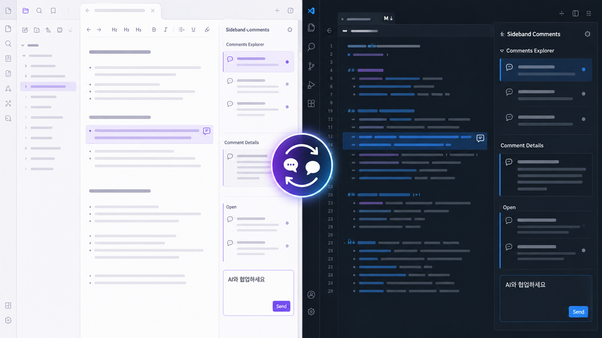

# Sideband Comments

<p align="center">
  
</p>

<p align="center"><strong>Work with AI where the document lives.</strong></p>

<p align="center"><strong>English</strong> · <a href="README.ko.md">한국어</a></p>



AI conversations move fast, but the reasoning behind a change often disappears into chat history. Sideband Comments anchors questions, replies, and decisions to the exact text under review while keeping the document itself clean.

Open the same review history in Obsidian or VS Code. Writers, knowledge workers, developers, and file-aware AI tools can discuss a document, inspect the resulting change, and resolve the thread only after it has been verified.

## Why

- **Context attached to the exact text** — keep each discussion beside the passage, paragraph, or code range it concerns.
- **One review history across two editors** — continue the same conversation in Obsidian and VS Code.
- **Original text preserved for verification** — compare what was reviewed with what the document says now.
- **Local-first, append-only storage** — retain the full discussion history without embedding review data in the document.

## Built for code and writing

Sideband Comments is not limited to developer code review. A developer can review AI-assisted code in VS Code while a writer, researcher, or knowledge worker reviews AI-assisted prose in Obsidian. Both workflows use the same document-grounded conversation model: comment on an exact passage, inspect the change, and resolve only after verification.


When a file-aware AI tool has access to the workspace, instructions and replies can stay attached to the source instead of being repeatedly transferred through a separate chat. Sideband Comments does not call an AI service and requires no MCP server; the agent skill it ships is optional. It provides the durable local review layer that people and tools can share.

## How it works

1. Select the exact text or code that needs discussion.
2. Create a Sideband comment and continue the thread with people or a workspace-aware AI tool.
3. Review the creation-time original text, the current document, and the full reply history together.
4. Resolve the thread only after the resulting document has been verified.

Markdown and source files remain unchanged when a comment is created, replied to, edited, deleted, resolved, or re-anchored. Both editor extensions share one append-only store:

```text
.comments/
├── documents/
│   └── <bundle-id>.jsonl    one file per document, holding its threads
└── threads/
    └── <thread-id>.jsonl    earlier layout, still read
```

## Installation

### VS Code

Install from the [Visual Studio Marketplace](https://marketplace.visualstudio.com/items?itemName=insung.sideband-comments-vscode), or search **Sideband Comments** in the Extensions view.

Comments Explorer groups commented files by workspace and directory. In Comment Details, double-click a comment body to open Save/Cancel editing (or focus it and press Enter). Delete opens a VS Code confirmation dialog; confirming hides the comment while preserving its JSONL history.

### Obsidian

Install from [Obsidian Community Plugins](https://community.obsidian.md/plugins/sideband-comments), or search **Sideband Comments** under Settings → Community plugins → Browse.

The Obsidian adapter is desktop-only. It provides Live Preview highlights plus a two-part sidebar: a directory-tree comment explorer above the selected note's inline comment, reply, edit, delete, resolve, re-anchor, and resolved-visibility controls. The new-comment composer previews the current editor selection, and existing comment bodies open inline editing on double-click. Reading View range mapping is not included yet.

### Building from source

To try an unreleased change, package the app yourself and install the artifact:

```bash
npm run package --workspace sideband-comments-vscode
code --install-extension apps/vscode/dist/sideband-comments-vscode-<version>.vsix --force
```

```bash
npm run package --workspace sideband-comments-obsidian
```

For Obsidian, copy `main.js`, `manifest.json`, and `styles.css` from `apps/obsidian/dist/` into `<vault>/.obsidian/plugins/sideband-comments/`.

### AI agents

`.agents/sideband-comments/` holds an agent skill, so you can ask Claude Code or another agent to read
the comments on a file, fix what they ask for, and reply on the thread. Link it into your user scope:

```bash
ln -s "$PWD/.agents/sideband-comments" ~/.claude/skills/sideband-comments
```

Codex, Copilot CLI, and Gemini CLI read `~/.agents/skills/` instead. The skill needs Python 3.9 or
later and works on any project with a `.comments` directory.

A comment is anchored to a quote of the document text, so editing that text orphans the thread — the
skill re-anchors it before replying, and never resolves a thread on your behalf.
[Read the guide](docs/agent-skill.md).

## Migrating Tandem Comments

[Tandem Comments](https://community.obsidian.md/plugins/tandem-comments) is an Obsidian plugin that keeps review threads inside the note, in fenced blocks. This migration lifts those threads out into the `.comments` store, leaving the Markdown clean.

Migration is a dry-run unless `--write` is explicitly supplied.

```bash
npm run build --workspace @sideband-comments/migrate
node packages/migrate/dist/sideband-migrate.js /path/to/vault
node packages/migrate/dist/sideband-migrate.js /path/to/vault --write
```

The write path records JSONL events before atomically replacing each Markdown file. Existing thread IDs with different events stop the migration instead of being overwritten.

## Architecture

```text
packages/core/          editor-neutral domain and use cases
packages/jsonl-store/   .comments persistence adapter
packages/migrate/       Tandem fenced-block migration
apps/vscode/            VS Code CommentController adapter
apps/obsidian/          Obsidian sidebar and Live Preview adapter
.agents/                agent skill and its tool
```

The core owns thread events, deterministic folding, quote anchors, edit/delete history, resolve/reopen, re-anchor, and file relocation. Editor packages only translate host API events into core use cases. VS Code and Obsidian both present a workspace-wide file explorer above a selected-file detail editor, including re-anchor and show/hide-resolved controls.

## Development

Requirements: Node.js 20 or newer and npm.

```bash
npm install
npm test
npm run typecheck
npm run build
```

## App version policy

VS Code and Obsidian releases may increment their patch versions independently, but they must share the same `major.minor` line. For example, VS Code `1.0.3` and Obsidian `1.0.7` are valid; `1.1.x` and `1.0.x` are not. Obsidian's package and manifest versions must match exactly.

`npm test`, the root build, each app package command, and the `App version policy` GitHub Actions check run the same validation:

```bash
npm run check:app-versions
```

Require the `app-version-policy` status check in the default branch protection rules to prevent mismatched version lines from being merged.

## Git synchronization

Tracking `.comments/` in Git keeps comment history available on other computers and allows the VS Code and Obsidian extensions to share it. This removes review-only changes from Markdown and code files, but comment activity still creates changes under `.comments/`. Ignoring `.comments/` avoids Git changes at the cost of requiring another synchronization mechanism.

## Inspiration and license

Sideband Comments is inspired by [Tandem Comments](https://community.obsidian.md/plugins/tandem-comments) and Anchored Comments. This repository is a new MIT-licensed implementation of the sidecar protocol and editor adapters; it includes no MCP server, and its agent skill is optional.
