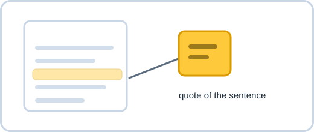
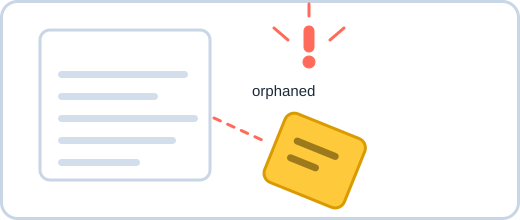
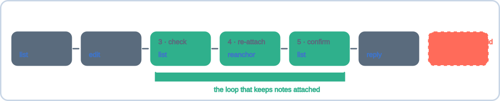
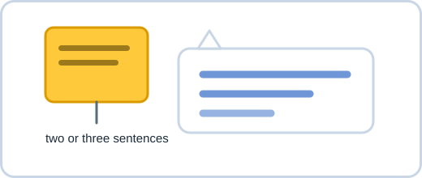

# Answering comments with an agent

*[한국어](agent-skill.ko.md)*

## What Sideband Comments is

Sideband Comments keeps review threads **beside** a document instead of inside it. Nothing is
written into your file — the threads live in `<project root>/.comments` as append-only JSONL, so the
document you commit stays exactly the document you wrote.

Two editors read that same store: a VS Code extension and an Obsidian plugin. A comment left in one
appears in the other, and because the store is plain text in your repository, comments travel through
`git` like the rest of the project.

A thread is attached to a **quote of the document text** — the sentence itself, plus a little of what
surrounds it — not to a line number. Line numbers move whenever anyone adds a paragraph above;
a quote does not. That one decision is what makes the comments survive editing, and it is also the
one thing you have to understand before letting an agent touch them.

## What the skill adds

An agent that can read your files cannot safely write the comment store. The events carry ids,
per-thread revisions, a store lock, and those quoted anchors; hand-written JSONL corrupts threads
that the editors then refuse to fold.

The skill gives the agent a tool instead, so you can say "check the comments on this file and fix
it" and get back edited prose plus a reply on the thread you left.


## Why a comment can fall off



A thread holds a copy of the sentence it is attached to. To draw the comment in the right place, the
editors search the document for that exact text.


Then the agent does what you asked and rewrites that sentence.



Now the search finds nothing. The thread is **orphaned**: still in the store,
still holding its comments, but no longer pointing at anything. This is not an edge case — it is the
normal result of an agent doing what you asked, because the sentence you commented on is usually the
sentence that needed changing.

So the skill's job is not only "read the comment and fix the file". It is "fix the file **and put the
comment back on the text that replaced it**."

## The flow



| Step | What happens |
|---|---|
| 1 · read | `list` shows every thread on the file, each with its anchor state |
| 2 · change | The agent edits the document |
| 3 · check | `list` again — threads whose quote was rewritten now read `orphaned` |
| 4 · re-attach | `reanchor` points each orphan at the text that replaced it |
| 5 · confirm | `list` once more; every thread should read `resolved` |
| 6 · answer | `reply` adds the agent's comment to the thread |

Steps 3–5 are the loop that keeps comments attached. `reply` refuses to run on an orphaned thread and
prints the `reanchor` command to run first, so a forgotten re-anchor stops the work rather than
quietly detaching your comment.


## What the agent writes back



The reply is two or three sentences: **what changed**, then **anything it could not settle**. You
already have the diff and you wrote the comment, so neither is restated.

When a comment asks for something the project gives no way to verify — an approval process, an
on-call rota, a name — the agent makes the smallest change the comment justifies and names the
unverified part in the reply, rather than inventing specifics and putting them in your document as
fact.

## What the agent will not do

It will not resolve your threads. Deciding that a comment is answered belongs to whoever wrote it,
so the tool has **no `resolve` command at all** — the constraint is in the tool's surface, not in a
sentence the model might read past. Resolve threads yourself in VS Code or Obsidian.

It also will not create new threads, delete comments, or reopen resolved ones, for the same reason.

## Install

Link the skill directory into your agent's user scope:

```bash
ln -s "$PWD/.agents/sideband-comments" ~/.claude/skills/sideband-comments
```

Codex, Copilot CLI, and Gemini CLI read `~/.agents/skills/` instead:

```bash
ln -s "$PWD/.agents/sideband-comments" ~/.agents/skills/sideband-comments
```

It needs Python 3.9 or later, which macOS and most Linux distributions already have. The skill works
on any project containing a `.comments` directory, not only this repository.

## Using it

Ask in your own words, naming a file or a directory:

> "docs/guide.md 에 코멘트 남겼어. 확인하고 고쳐줘."

You can run the same tool yourself:

```bash
python3 .agents/sideband-comments/scripts/sideband_comments.py list docs/
python3 .agents/sideband-comments/scripts/sideband_comments.py list --orphaned-only docs/
```

`list` reports each thread's anchor state:

| State | Meaning |
|---|---|
| `resolved` | The quote is in the document; the comment points at it |
| `ambiguous` | The quote occurs several times and the surrounding context cannot separate them |
| `orphaned` | The quote is gone — an edit removed or rewrote it |

Run the tool with `--help` for the rest.

## How it stays honest

The tool is Python so it runs anywhere with no install step, which means it re-implements the event
format that `packages/core` and `packages/jsonl-store` define in TypeScript. Two implementations of
one format drift apart unless something holds them together.

That something is `.agents/sideband-comments/scripts/sideband-comments-tool.test.ts`. It creates a
thread through the editors' own `CommentService`, drives the Python tool over it, and reads the
result back through `JsonlThreadRepository` — asserting that the TypeScript store folds the
Python-written events into the same thread, in the same bundle. It is a TypeScript test precisely
because it has to import the editors' real code to prove the agreement.

**If you change the event schema, change both sides.** That test is what tells you when you didn't.
